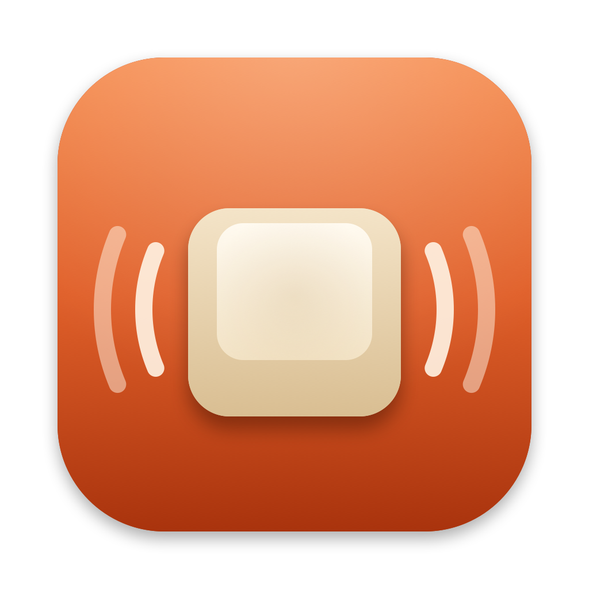

<p align="center">
  
</p>

<h1 align="center">Rustyvibes</h1>

<p align="center">
  Mechanical keyboard sounds for every key press, as a tiny native macOS menu bar app written in Rust.
</p>

---

Rustyvibes 2 plays the sound of a real mechanical keyboard every time you press a key, in any
app. It lives in the menu bar, ships with 21 soundpacks, and is built to cost nothing while you
are not typing: 0% CPU, no timers, no wakeups, and the audio device is released when idle.

## Install

1. Download `Rustyvibes-2.0.0.dmg`, open it, and drag **Rustyvibes** to **Applications**.
2. Open Rustyvibes. A keycap appears in the menu bar and a window explains the one permission it
   needs.
3. Click **Open System Settings** and switch on Rustyvibes under
   **Privacy & Security → Input Monitoring**. The window confirms when it is done (if macOS asks
   for a restart, use **Relaunch Rustyvibes**).

Builds that have not been notarised by Apple are blocked by Gatekeeper on first open: right-click
the app and choose **Open**, or allow it under **System Settings → Privacy & Security**.

Requires macOS 13 Ventura or later, on Apple Silicon or Intel.

## Features

- **21 soundpacks**, grouped as Linear, Tactile and Clicky: Cherry MX Black, Red, Brown and Blue
  (each with ABS and PBT keycaps), Gateron Black Ink and Red Ink, NovelKeys Cream, Alpaca,
  Turquoise Tealios, Holy Panda, Topre, Topre Purple Hybrid, Everglide Crystal Purple and Oreo,
  Kailh Box Navy, SKCM Blue Alps and Buckling Spring. Picking one plays a short preview.
- **Key release sounds** for packs recorded with them: the upstroke plays when you let go.
- **Natural variation**: each keystroke gets a slightly different pitch (±35 cents) and level
  (±1.5 dB), so fast typing never sounds like a machine gun.
- **Spatial stereo**: keys on the left sound slightly left, keys on the right slightly right.
- **Volume** slider with live feedback, an on/off switch, and **Launch at Login**.
- **Private by design**: Rustyvibes only learns which key moved, never what you type. Nothing is
  recorded or stored, and it never touches the network.

## Performance

Measured on an M2 Max (macOS 26.2) with the signed release bundle:

| | Target | Measured |
|---|---|---|
| CPU while idle | 0% | **0.0%** |
| Wakeups while idle (after the audio idle stop) | 0/s | **0/s** |
| CPU while typing 10 keys/s | — | **0.4%** |
| Physical memory footprint | < 25 MB | **16–17 MB** |
| Universal binary (arm64 + x86_64) | < 3 MB | **1.16 MB** (arm64 slice 541 KB) |
| App bundle / DMG | — | 17.1 MB / 12.4 MB |
| Key event handling (event-tap callback) | < 20 µs | **≤ 5 µs** |
| Audio render callback (budget 2,667 µs) | ≪ budget | **≤ 8 µs** |
| Mixer cost with 32 voices | < 1% | **0.39%** (10.5 µs per block) |
| Clip onset (silence before the click) | ≤ 1 ms | **≤ 0.5 ms** |
| Loudness spread across packs | ≤ ±1.5 dB | **0.0 dB** |
| Launch to menu bar ready (warm) | — | ~140–180 ms |

While you type, sounds go out through a 128-frame buffer (≈2.7 ms at 48 kHz) plus your audio
device's own latency. After 15 s of silence Rustyvibes stops and releases the audio device so it
never keeps your Mac awake; the next key press restarts it, which takes ~13 ms on a device that is
already running and up to ~50 ms on some USB interfaces that start from cold.

## How it works

```
            ┌──────────────────────── main thread (AppKit) ────────────────────────┐
            │ status item + NSMenu · onboarding window · NSUserDefaults             │
            │      writes settings atomics · pushes preview sounds (UI ring)        │
            └───────────────┬───────────────────────────────────────┬───────────────┘
                            │ atomics (enabled, volume, pack, …)    │ SPSC ring
┌── event-tap thread ──┐    ▼                                       ▼
│ listen-only          │  shared engine state                ┌─ CoreAudio IO thread ─┐
│ CGEventTap           ├─ SPSC ring (keys) ─────────────────►│ render callback:      │
│ key → clip lookup,   │                                     │ start voices, cubic   │
│ variation, panning   │──wake (only if audio is stopped)──┐ │ resampling, mix,      │
└──────────────────────┘                                   │ │ ramped gain, limiter  │
                                                           ▼ └──────────▲────────────┘
                                              ┌─ audio control thread ─┐│ start / stop
                                              │ starts the AUHAL unit  ├┘
                                              │ on demand, stops after │
                                              │ 15 s of silence        │
                                              └────────────────────────┘
```

- **Input**: a listen-only `CGEventTap` on its own high-priority thread. It needs only the Input
  Monitoring permission, ignores auto-repeat, and decodes modifier keys from their device flags.
  The callback does two table lookups and pushes one command into a lock-free ring.
- **Audio**: an AUHAL default-output unit (it follows the system output device), fed by a
  32-voice mixer with 4-point cubic interpolation for sample-rate conversion and pitch variation,
  a ramped master gain and a soft limiter. The render callback never allocates, locks, logs or
  calls Objective-C.
- **Soundpacks**: original recordings live in `assets/soundpacks` and are converted at build time
  into `.rvpack` files: decoded, trimmed to their transients (some recordings start up to 54 ms
  late), loudness-matched, dithered to 16-bit mono, and mapped to every macOS key.
  At runtime they are memory-mapped and never decoded; only the active pack's samples are kept
  resident.
- **UI**: native AppKit through [objc2](https://github.com/madsmtm/objc2): an `NSMenu` with a
  header switch, a grouped soundpack submenu with tinted keycap glyphs, a volume slider and
  toggles; icons are drawn in code.

The crates: `crates/rustyvibes` (the app), `crates/rvpack` (the soundpack format and keyboard
geometry) and `crates/xtask` (soundpack conversion, bundling and signing).

## Building from source

You need Rust (stable) and Xcode's command-line tools.

```sh
cargo xtask packs                          # convert assets/soundpacks → target/packs/*.rvpack
cargo run --release -p rustyvibes          # run from the terminal (uses the terminal's Input Monitoring grant)
cargo xtask bundle                         # target/bundle/Rustyvibes.app (universal, signed)
cargo xtask dmg                            # target/Rustyvibes-2.0.0.dmg
```

`cargo xtask bundle` signs with the first "Developer ID Application" identity in your keychain
(hardened runtime, secure timestamp) and falls back to an ad-hoc signature; `--adhoc` forces
ad-hoc and `--native` builds only for your Mac's architecture. To notarise a release:

```sh
xcrun notarytool submit target/Rustyvibes-2.0.0.dmg --keychain-profile <profile> --wait
xcrun stapler staple target/Rustyvibes-2.0.0.dmg
```

Tests and lints: `cargo test --workspace`, `cargo clippy --workspace --all-targets -- -D warnings`.
The full-catalog conversion test runs with `cargo test -p xtask --profile xtask -- --ignored`.

### Diagnostics

```
rustyvibes --selftest [--audible]   play every soundpack through the real audio path and report timings
rustyvibes --tap-test               check that key events reach the engine (injects one Shift press)
rustyvibes --bench                  measure the mixer
rustyvibes --snapshot [dir]         render the UI pieces to PNG
RUSTYVIBES_LOG=1 rustyvibes         log to stderr with timestamps
```

## Troubleshooting

- **No sound**: check the switch at the top of the menu, the volume slider, your Mac's output
  volume, and that Rustyvibes is enabled under Privacy & Security → Input Monitoring.
- **No sound in password fields or in Terminal**: that is macOS's Secure Keyboard Entry. While it
  is on, no app can observe key presses, by design.
- **"Key Release Sounds" is greyed out**: the selected pack was recorded without separate release
  sounds (most Mechvibes packs were recorded as a single sound per key).

## Credits and licences

Rustyvibes is MIT-licensed. The soundpacks come from two MIT-licensed projects:
[Mechvibes](https://github.com/hainguyents13/mechvibes) by Hai Nguyen (the Cherry MX, Topre Purple
Hybrid and Everglide packs) and [kbsim](https://github.com/tplai/kbsim) by Thomas Lai (all other
packs). Full licence texts, including those of the Rust crates Rustyvibes uses, are in
[`THIRD_PARTY_NOTICES.md`](THIRD_PARTY_NOTICES.md) and inside the app bundle under
`Contents/Resources/Licenses`.
